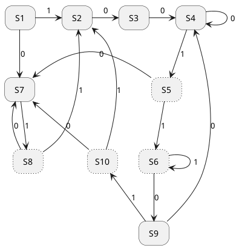

```plantuml
@startuml
hide empty description

state S5 #line.dotted;
state S6 #line.dotted;
state S8 #line.dotted;
state S10 #line.dotted;

S1 -right-> S2 : 1
S1 --> S7 : 0
S2 -right-> S3 : 0
S3 -right-> S4 : 0
S4 -> S4 : 0
S4 --> S5 : 1
S5 --> S6 : 1
S5 -left-> S7 : 0
S6 --> S9 : 0
S6 -> S6 : 1
S7 --> S8 : 1
S8 -up-> S7 : 0
S8 -up-> S2 : 1
S9 -up-> S4 : 0
S9 -left-> S10 : 1
S10 -up-> S7 : 0
S10 -up-> S2 : 1
@enduml
```
